## Image Segmentation via Clustering Methods

Image segmentation is an important part of image analysis. The purpose of segmentation is to simplify the image to something (potentially) easier to understand. For instance, you may want to use segmentation to label objects in an image (semantic segmentation) or to distinguish the foreground from the background. You may just want to identify portions of an image where the color or texture are fairly homogenous. Image segmentation has many practical applications such as tissue identification or tumor location in medical imaging, pedestrian identification in object detection or facial recognition tasks. For this post, and following posts, I am going to be discussing various methods for image segmentation. I will start with some of the simplest, clustering based methods. In a post to follow this one, I will use a probabilistic graphical model, a Markov random field, to produce an image segmentation. After that, I will begin discussion on convolutional neural networks and their use in object detection and semantic segmentation (with masking). That will most likely take a few posts in and of itself. But for now, on to clustering!

In image segmentation, we are looking for ways to segment an image in to distinct parts. For many purposes, we may want to segment based on homogeneous regions of color. For instance, consider the following picture of a dog (a pitbull to be specific).


Now were, as humans, can clearly identify the pitty in this picture. However, suppose we want a machine to identify the pitbull in this picture. We notice that perhaps a way we can do this is by identifying pixels that belong to the pitbull, and those that belong to the background. We may try to do this using pixel color differences in the RGB representation of colors; Red, Green Blue each varying from 0-255. Each pixel in RGB representation is given by an ordered triplet (R,G,B). Let's import the image using python and convert to a numpy array:


```python
import numpy as np
import matplotlib.pyplot as plt
from PIL import Image as image
from skimage.color import rgb2lab, rgb2grey, lab2rgb
```


```python
img = image.open('pitbull.jpg')
img.load()
img_array = np.asarray(img, dtype="int32")
plt.imshow(img)
plt.axis('off')
plt.show()
```


Now, taking a look at the shape of the array create from the image, we can see that it is (69,128,3), that is it ia a 69x128 image an each entry has a three dimensional data. If we look atone pixel, we can see the (R,G,B) values:


```python
print(img_array.shape)
print(img_array[0,0,:])
```

    (411, 760, 3)
    [122 145 103]


We can see that the pixel has (R,G,B) = (120,144,92) which is a darkish green. So that pixel is in the grass. What may be interesting is to visualize the pixels in RGB space. We do this with scatter plots, two dimensiona at a time. This will require reshaping the array into a \\(69 \times 128 = 8829\\) by \\(3\\) array. We will also sample 400 rows randomly to reduce the number of points to plot.


```python
w=img_array.shape[0]
h = img_array.shape[1]
img_train = img_array.reshape([w*h,3])
rndm = np.random.randint(w*h, size=400)

fig, ax = plt.subplots(1,3)
ax[0].scatter(img_train[rndm,0], img_train[rndm,1])
ax[0].title.set_text('R vs G')
ax[1].scatter(img_train[rndm,0], img_train[rndm,2])
ax[1].get_yaxis().set_visible(False)
ax[1].title.set_text('R vs B')
ax[2].scatter(img_train[rndm,1], img_train[rndm,2])
ax[2].get_yaxis().set_visible(False)
ax[2].title.set_text('G vs B')
plt.show()
```


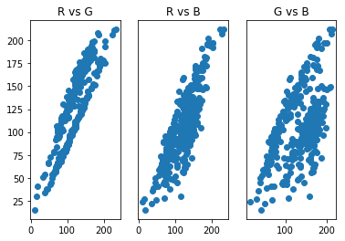


From this these scatter plots, we can observe that the pixels appear to cluster into two groups, which may be related to the purple-ish color of the pitbull and the green grass of the background. Clustering methods then may be a good place to start our segmentation attempts. A popular clustering method is called K-means clustering.

## K-Means Clustering

K-means clustering partitions data into \\(k\\) where each of the data points belongs to the cluster with the nearest center. Cluster centers are determined iteratively using the following algorithm:

1. Choose the number of clusters \\(k\\) and a distance metric \\(\|\|\\)
2. Initialize cluster centers, \\(\mu_k^0\\) randomly by selecting a datapoint (or using a more sophisticated algorithm such as k-means++)
3. Assign each data point, \\(x_i\\) to a cluster by finding the \\(\mu_k^{t}\\) satisfying
$$\min_k \| x_i - \mu_k^{t} \|^2$$
4. Find the new cluster centers using
$$\mu_k^{t+1} = \frac{1}{|k|} \sum_{j\in k}x_j$$
5. Repeat steps 3 and 4 until no data point changes cluster or a given number of iterations is reached.

Let's use the sci-kit learn implementation of k-means clustering to put each pixel into a cluster of similar pixels. It's hoped that doing this will result in two clusters, one for background and one for the pitbull. To visualize each cluster, we will assign each pixel in the cluster the value of the cluster center. Note that sci-kit learn uses Euclidean distance as the distance metric.


```python
from sklearn.cluster import KMeans

kmeans = KMeans(n_clusters=2)
mod = kmeans.fit(img_train)
img_cluster = np.copy(img_train)
col = mod.cluster_centers_
for i in range(img_train.shape[0]):
    a = mod.labels_[i]
    img_cluster[i,:] = col[a,:]
img_cl = img_cluster.reshape([w,h,3])

img_k = image.fromarray(np.uint8(img_cl))
plt.imshow(img_k)
plt.axis('off')
plt.show()
```


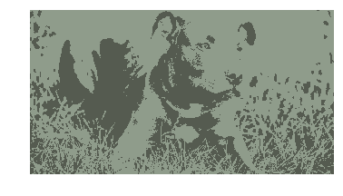


Not quite what we were hoping for. We can see that the clustering seemed to have put the darker portions of the image in a cluster and the lighter portions in another, not the color of the pitbull vs the color of the grass. LEt's take a look at the scatter plots again to see which points were clustered together.


```python
a = np.where(mod.labels_==0)[0]
b = np.where(mod.labels_==1)[0]
img_c1 = img_train[a,:]
img_c2 = img_train[b,:]
rndm1 = np.random.randint(len(img_c1), size=200)
rndm2 = np.random.randint(len(img_c2), size=200)


fig, ax = plt.subplots(1,3)
ax[0].scatter(img_c1[rndm1,0], img_c1[rndm1,1])
ax[0].scatter(img_c2[rndm2,0], img_c2[rndm2,1])
ax[0].title.set_text('R vs G')
ax[1].scatter(img_c1[rndm1,0], img_c1[rndm1,2])
ax[1].scatter(img_c2[rndm2,0], img_c2[rndm2,2])
ax[1].get_yaxis().set_visible(False)
ax[1].title.set_text('R vs B')
ax[2].scatter(img_c1[rndm1,1], img_c1[rndm1,2])
ax[2].scatter(img_c2[rndm2,1], img_c2[rndm2,2])
ax[2].get_yaxis().set_visible(False)
ax[2].title.set_text('G vs B')

plt.show()
```


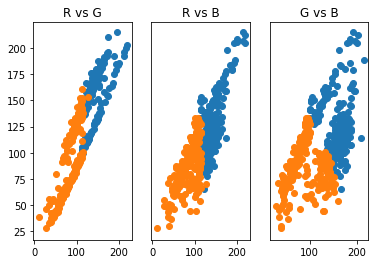


From this, we see that indeed, the clustering has placed the darker portions (low RGB values) in one cluster and lighter portions (higher RGB values) in another. Maybe we can remedy some of this by increasing the number of clusters. Let's use three clusters and observe the results.


```python
kmeans = KMeans(n_clusters=3)
mod = kmeans.fit(img_train)
img_cluster = np.copy(img_train)
col = mod.cluster_centers_
for i in range(img_train.shape[0]):
    a = mod.labels_[i]
    img_cluster[i,:] = col[a,:]

img_cl = img_cluster.reshape([w,h,3])
img_k = image.fromarray(np.uint8(img_cl))
plt.imshow(img_k)
plt.axis('off')
plt.show()
```


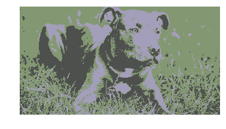


That looks much better! We could use two of our clusters to identify the majority of the pitbull, though there is still noise in the darker portions of the grass. Let's take a look at the scatter plots again.


```python
a = np.where(mod.labels_==0)[0]
b = np.where(mod.labels_==1)[0]
c = np.where(mod.labels_==2)[0]
img_c1 = img_train[a,:]
img_c2 = img_train[b,:]
img_c3 = img_train[c,:]
rndm1 = np.random.randint(len(img_c1), size=200)
rndm2 = np.random.randint(len(img_c2), size=200)
rndm3 = np.random.randint(len(img_c3), size=200)

fig, ax = plt.subplots(1,3)
ax[0].scatter(img_c1[rndm1,0], img_c1[rndm1,1])
ax[0].scatter(img_c2[rndm2,0], img_c2[rndm2,1])
ax[0].scatter(img_c3[rndm3,0], img_c3[rndm3,1])
ax[0].title.set_text('R vs G')
ax[1].scatter(img_c1[rndm1,0], img_c1[rndm1,2])
ax[1].scatter(img_c2[rndm2,0], img_c2[rndm2,2])
ax[1].scatter(img_c3[rndm3,0], img_c3[rndm3,2])
ax[1].get_yaxis().set_visible(False)
ax[1].title.set_text('R vs B')
ax[2].scatter(img_c1[rndm1,1], img_c1[rndm1,2])
ax[2].scatter(img_c2[rndm2,1], img_c2[rndm2,2])
ax[2].scatter(img_c3[rndm3,1], img_c3[rndm3,2])
ax[2].get_yaxis().set_visible(False)
ax[2].title.set_text('G vs B')

plt.show()
```


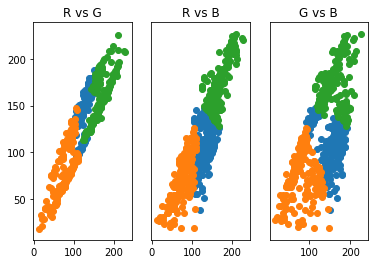


We see now that there is a cluster with medium RGB values that tend belong to one of the clusters we are trying to isolate. The problem that we are seeing is due to the k-means clusters are based on the radial distance a data point is from a cluster center. This type of clustering has trouble with long, narrow data clusters. K-means, thus, cannot produce optimal clustering for identifying the pitbull and grass in only two clusters. We see that increasing clusters does help to identify the pitbull from the grass, is there a way to identify the optimal \\(k\\)?

Let's see what happens for the image when we increase \\(k\\) further to four.


```python
kmeans = KMeans(n_clusters=4)
mod = kmeans.fit(img_train)
img_cluster = np.copy(img_train)
col = mod.cluster_centers_
for i in range(img_train.shape[0]):
    a = mod.labels_[i]
    img_cluster[i,:] = col[a,:]

img_cl = img_cluster.reshape([w,h,3])
img_k = image.fromarray(np.uint8(img_cl))
plt.imshow(img_k)
plt.axis('off')
plt.show()
```


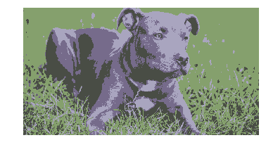


That gives more detail, but doesn't help with identifying parts of the scene. So it appears that we could stop at three clusters  to have a solid segmentation of the image. We could also use what is known as the elbow method to find the best number of clusters. This method looks at a plot of the normalized sum of distances, \\(\eta\\) from each data point to the cluster it is assigned to for each value of \\(k\\). The "elbow" of the plot is the value \\(k\\) after which \\(\eta\\) doesn't change much with with an increase of \\(k\\). The following code provides this analysis.


```python
from scipy.spatial.distance import cdist

d = []
K = range(1,10)
for k in K:
    kmeanModel = KMeans(n_clusters=k).fit(img_train)
    kmeanModel.fit(img_train)
    d.append(sum(np.min(cdist(img_train, kmeanModel.cluster_centers_, 'euclidean'), axis=1)) / img_train.shape[0])

plt.plot(K,d)
plt.ylabel("\u03B7")
plt.xlabel("k")
plt.show()
```


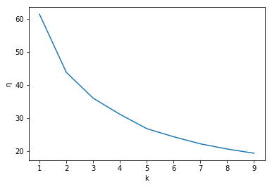


Unfortunately this plot does not have a super elbow and that we could probably choose \\(k\in \{3,4,5\}\\) and have decent segmentation. So we can choose \\(k=4\\) as the best value of \\(k\\) which we see does a fairly good job after some inspection of the resulting clustered image. But again, we wish to only have two clusters and we know due to it's spherical clusters, k-means cannot offer this solution, so is there another method that can? The answer is yes! Using Gaussian mixture models, we can find two clusters that encompass the long, narrow clusters of our data.

## Gaussian Mixture Models

A Gaussian mixture model is a linear superposition of Gaussians:

$$
p(x) = \sum_{k=1}^K \pi_k \mathcal{N}(x|\mu_k, \Sigma_k)\\
\mathcal{N}(x|\mu_k, \Sigma_k) = \frac{1}{\sqrt{(2\pi)^K\Sigma_k}}\exp{\left (-\frac{1}{2}(x-\mu_k)^T\Sigma_k(x-\mu_k)\right )}
$$

where \\(\mu_k\\) and \\(\Sigma_k\\) are the mean and covariance matrix of the \\(k\\)th component of the misxture. The parameters \\(\pi_k\\) are the mixing coefficients and with the properties that \\(\sum_{k=1}^k \pi_k=1\\) and \\(\pi_k\in[0,1]\\). These properties ensure the whole model normalizes to one. With this model, we are assuming that our pixels are mixtures of normally distributed subpopulations, those being the population of pixels belonging to the grass and those belonging to the pitbull. Therefore, we hope two find two components, \\(K=2\\), corresponding to the populations (just as we did with K-means). For more information on the probabilistic and latent variable interpretation of Gaussian mixture models, see *Pattern Recognition and Machine Learning* by Christopher Bishop.

Given the data set, how can we use this model to determine if the data produces two components corresponding to grass and pitbull. In general, to determine the values of then parameters \\(\{\pi_k, \mu_k, \Sigma_k\}\\) for some \\(k\\), we want to maximize the *log likelihood* function. This function is given by the *log* of \\(p(x)\\) given the data \\(x_n\\) (\\(n \in \{1,2,...,N\}\\) data points:

$$ \log{\prod_n p(x)} = \sum_n \log{p(x_n)} = \sum_n \log{\left (\sum_{k=1}^K \pi_k \mathcal{N}(x|\mu_k, \Sigma_k)\right )}$$

Unfortunately, when we take the derivative and set it equalt to zero (as we always do to maximize a function), it does not have a closed form solution. The most common algorithm for finding the optimal parameters, based on the desired number of components, is the expectation maximization (EM) algorithm. This algorithm makes use of Bayes rule for the probability \\(p(k|x)\\). From Bayes rule we obtain

$$ \gamma_k(x) = p(k|x) = \frac{p(k)p(x|k)}{p(x)}\\
=\frac{\pi_k \mathcal{N}(x|\mu_k, \Sigma_k)}{\sum_{k=1}^K \pi_k \mathcal{N}(x|\mu_k, \Sigma_k)}$$

where \\(\pi_k = \frac{N_k}{N}\\). We interpret \\(N_k\\) as the effective number of points assigned to cluster \\(k\\). The EM algorithm is as follow

1. Initialize the means \\(\mu_k\\), covariances \\(\Sigma_k\\) and mixing coefficients \\(\pi_k\\) and evaluate the initial values of the log likelihood.
2. E-step: Evaluate \\(\gamma_k\\) for the current parameter values.
3. M-step: Re-estimate parameters using current values of \\(\gamma_k \\)
$$\mu_k = \frac{\sum_{n=1}^N\gamma_k(x_n)x_n}{\sum_{n=1}^N\gamma_k(x_n)}\text{,  }
\Sigma_k = \frac{\sum_{n=1}^N\gamma_k(x_n)(x_n-\mu_k)(x_n-\mu_k)^T}{\sum_{n=1}^N\gamma_k(x_n)}\text{,  }
\pi_k = \frac{1}{N} \sum_{n=1}^N\gamma_k(x_n)$$
4. Evaluate the log likelihood and if there is no convergence, return to step 2.

The following code implements the scikit learn Gaussian mixture model (which estimates parameters using the EM algorithm) for our image.


```python
from sklearn.mixture import GaussianMixture

GM = GaussianMixture(n_components=2)
gm_mod = GM.fit(img_train)
img_cluster = np.copy(img_train)
pred=gm_mod.predict(img_train)
col = gm_mod.means_
for i in range(img_train.shape[0]):
    a = pred[i]
    img_cluster[i,:] = col[a,:]
img_cl = img_cluster.reshape([w,h,3])
plt.imshow(np.uint8(img_cl))
plt.axis('off')
plt.show()
```


Wow! That is an alomost perfect segmentation of the image into the pitbull and grass. Why did this work so well? Let's take a look at the scatter plots.


```python
a = np.where(pred==0)[0]
b = np.where(pred==1)[0]
img_c1 = img_train[a,:]
img_c2 = img_train[b,:]
rndm1 = np.random.randint(len(img_c1), size=200)
rndm2 = np.random.randint(len(img_c2), size=200)


fig, ax = plt.subplots(1,3)
ax[0].scatter(img_c1[rndm1,0], img_c1[rndm1,1])
ax[0].scatter(img_c2[rndm2,0], img_c2[rndm2,1])
ax[0].title.set_text('R vs G')
ax[1].scatter(img_c1[rndm1,0], img_c1[rndm1,2])
ax[1].scatter(img_c2[rndm2,0], img_c2[rndm2,2])
ax[1].get_yaxis().set_visible(False)
ax[1].title.set_text('R vs B')
ax[2].scatter(img_c1[rndm1,1], img_c1[rndm1,2])
ax[2].scatter(img_c2[rndm2,1], img_c2[rndm2,2])
ax[2].get_yaxis().set_visible(False)
ax[0].title.set_text('G vs B')

plt.show()
```


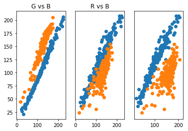


What we see here is that the Gaussian mixture model was able to produce components corresponding to the two long, narrow clusters we wanted. This is due to the covariance allowing for non-spherical, elliptical structures. This is a big strength of the Gaussian mixture model. There are other clustering methods that can handle data cluster with shapes like this. The following figure gives some clustering algorithms and how well they cluster certain shapes of data clusters (taken from the article https://towardsdatascience.com/the-5-clustering-algorithms-data-scientists-need-to-know-a36d136ef68)


The type of data this picture presents is given in the 4th row and as can be seen here, Gaussian mixture models (last column) work best for this kind of data. K-means (first column) as we have seen struggles with this type of cluster shape. Each clustering algorithm has it's strength and weakness and it is always a good idea to visualize the data first to see which algorithm might work best.

## Medical Image Example

Just as an example of a real world use of clustering, let's look at an MRI image of a brain tumor.


```python
img_tum = image.open('brain_tumor.jpg')
img_tum.load()
img_tum_array = np.asarray(img_tum, dtype="int32")

plt.imshow(img_tum)
plt.axis('off')
plt.show()
```


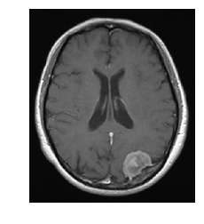


When I worked as a medical physicist in radiation oncology, one task during the treatment planning stage was to "contour" the bulk tumor as well as organs at risk. This involved filling in the CT image with a given color and labeling all of that color as being "tumor" or some organ at risk. This was to allow for dose calculations. The software we used had an option to automatically contour the tumor and organs at risk, and this process was calleds something like smart segmentation (if I remember correctly). And that's what the software did, segment out the different organs/tumors of interest! Now, these were much more sophisticated algorithms than I have discussed here, but let's see the results if we use K-means. Note that CT images are in grayscale, not RGB, but grayscale can be represented in RGB, which this image is.


```python
w = img_tum_array.shape[0]
h = img_tum_array.shape[1]
img_tum_r = img_tum_array.reshape([w*h,3])
k=5
kmeans = GaussianMixture(n_components=k)
mod = kmeans.fit(img_tum_r)
img_cluster = np.copy(img_tum_r)
col = [[0,0,0],[255,255,255],[255,0,0],[0,255,0],[0,0,255]]
pred = kmeans.predict(img_tum_r)
for i in range(img_tum_r.shape[0]):
    a = pred[i]
    img_cluster[i,:] = col[a]

img_cl = img_cluster.reshape([w,h,3])
img_k = image.fromarray(np.uint8(img_cl))
plt.imshow(img_k)
plt.axis('off')
plt.show()
```


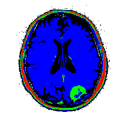


My color choices may not be the best, but you get the point. We can see the tumor segmented in green. There is some green with the skull as well which would require clean up, but not too bad for such a simple algorithm! There are ways to restrict cluster to be local using graph based segmentation or restring segmentation to specific regions through some preprocessing methods. I will have further posts on this type of work. Just for completnes, here is the tumor image segmented using a Gaussian mixture model. The results are very similar to K-means due to the fact that the images are really grayscale.


```python
w = img_tum_array.shape[0]
h = img_tum_array.shape[1]
img_tum_r = img_tum_array.reshape([w*h,3])
k=5
kmeans = KMeans(n_clusters=k)
mod = kmeans.fit(img_tum_r)
img_cluster = np.copy(img_tum_r)
col = [[0,0,0],[255,255,255],[255,0,0],[0,255,0],[0,0,255]]
pred = kmeans.predict(img_tum_r)
for i in range(img_tum_r.shape[0]):
    a = pred[i]
    img_cluster[i,:] = col[a]

img_cl = img_cluster.reshape([w,h,3])
img_k = image.fromarray(np.uint8(img_cl))
plt.imshow(img_k)
plt.axis('off')
plt.show()
```


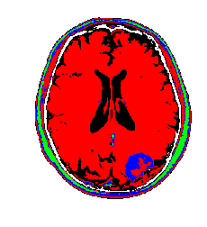


Thanks for reading, for any questions or comments please contact me via the e-mail on the home page. Enjoy!
